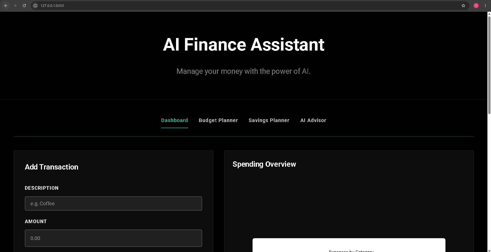
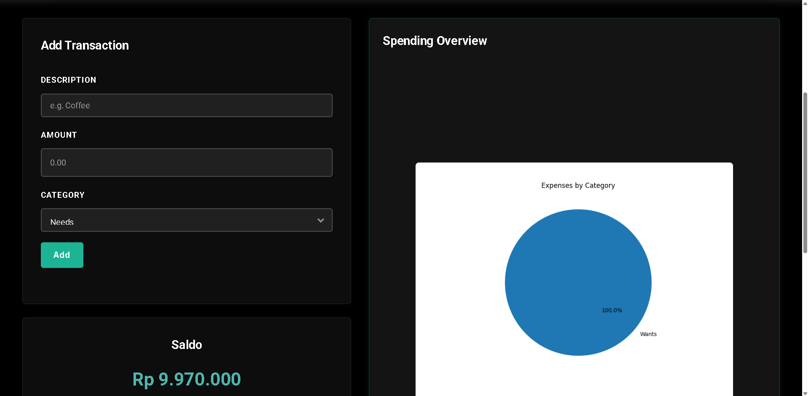
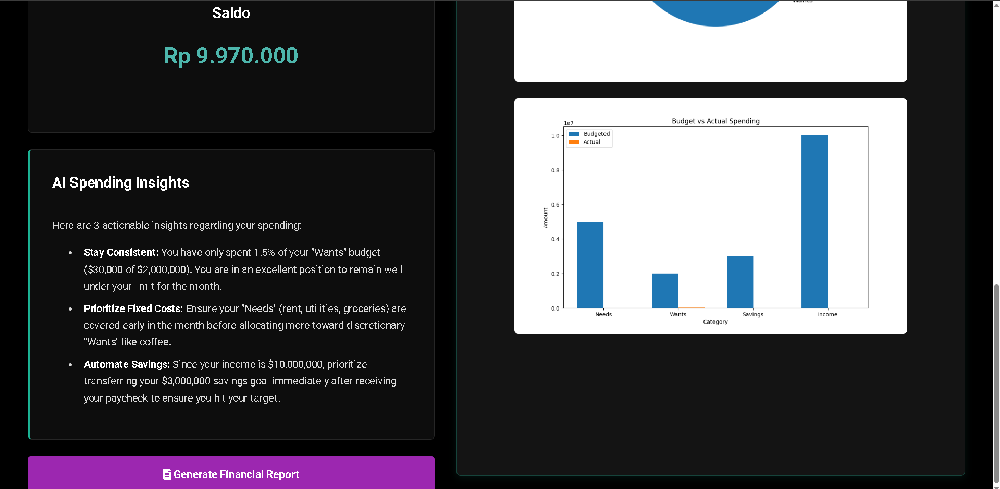
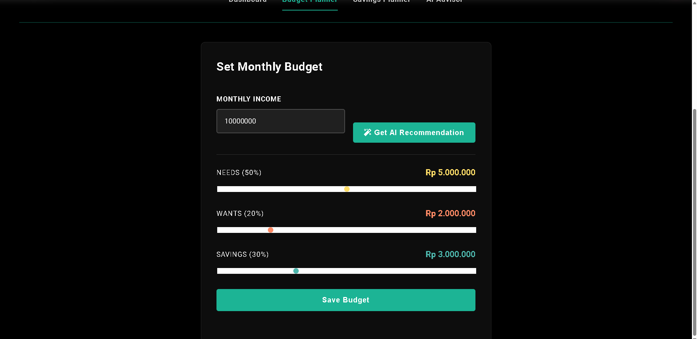
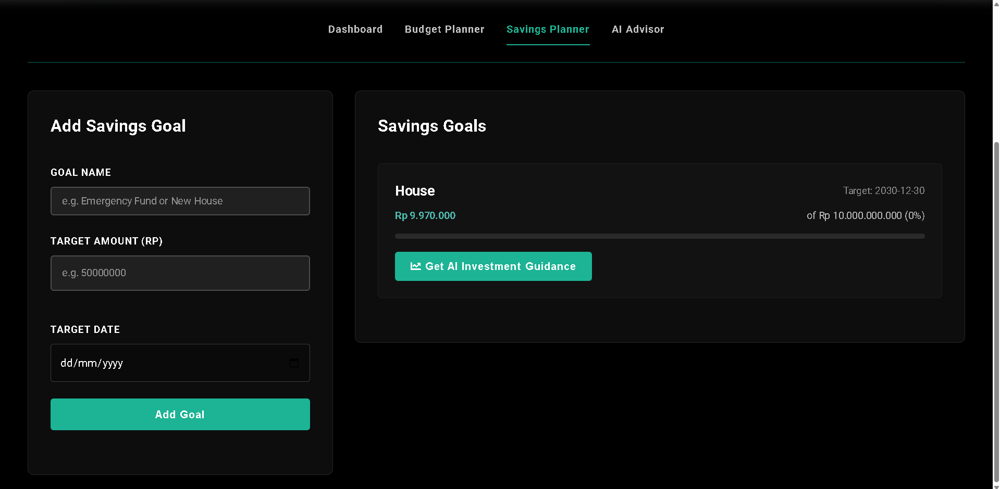
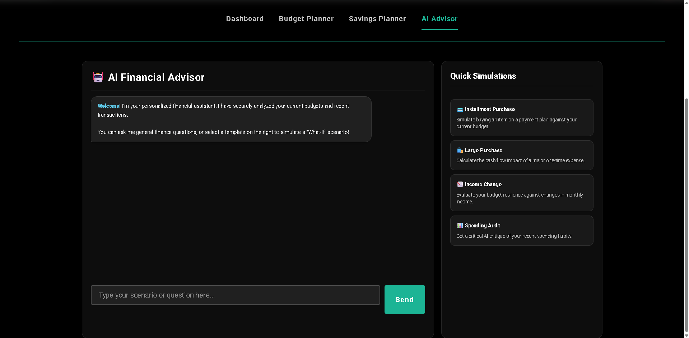
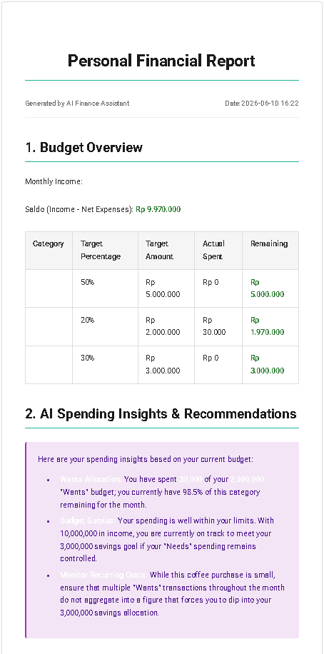
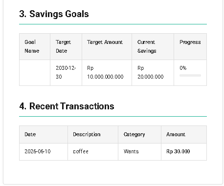

# Functional Prototype: AI Personal Finance Assistant

This is the prototype of my AI Personal Finance Assistant application. It is built to help users manage their income, track expenses, plan savings goals, and get recommendations using Gemini AI.

## Features List
1.  **Dashboard and Charts:** The homepage shows the active balance (saldo) and updates two charts (expense category and budget vs actual spending) dynamically when transactions are added.
2.  **Add Expense:** A simple form to input transactions with amount, category (Needs, Wants, Savings), and description.
3.  **AI Budget Planner:** Allows users to set monthly income and category limits. Features a "Get AI Recommendation" button to automatically suggest category limits using the 50/30/20 rule.
4.  **AI Financial Advisor Chatbot:** A chat simulator where users can type questions to the AI and receive financial advice.
5.  **Savings Goal Planner:** Set specific savings targets with a target date. The progress bar updates according to active balance.
6.  **AI Investment Guidance & Finish Goal:** Under savings goals, users can ask AI for customized investment advice. When active balance reaches the goal target, a "Finish Goal" button appears, which automatically deducts the target amount from the active balance and removes the goal.
7.  **Generate Report:** Prints a detailed financial report including all transactions, active balance, and AI-generated insights.

## How to Use the App
1.  **Inputting Transaction:** Go to homepage dashboard, fill "Description", "Amount", and select "Category". Click "Add" button.
2.  **Using AI Budget Helper:** Navigate to "Budget Planner", input your "Monthly Income", then click "Get AI Recommendation". It will auto-fill the sliders. Press "Save Budget" to save.
3.  **Checking Savings Goal:** Go to "Savings Planner", enter goal name, target amount, and date. Press "Add Goal".
4.  **How to Finish Goal:** When your active balance is enough to meet the target, the "Finish Goal" button will show up. Click it to complete the goal and deduct the money from your balance.
5.  **Asking AI Advisor:** Go to "AI Advisor", type your question in the text area, and click "Ask" to get personalized advice.

## App Screenshot Placeholders
> 1.  Main Dashboard (showing charts and list of transactions).

> 2.  Budget Planner Page (after clicking Get AI Recommendation).

> 3.  Savings Planner Page (showing active goals and the green Finish Goal button).

> 4.  AI Chatbot Advisor interface.

> 5.  Detailed Financial Report.

