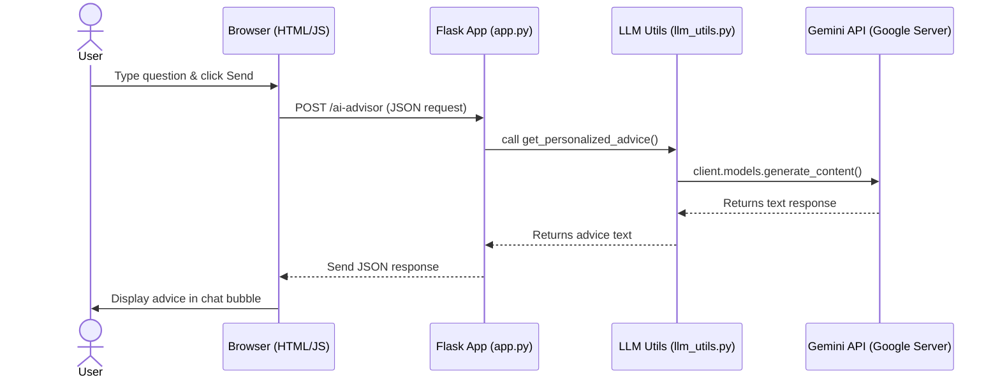

# Technical Documentation: AI Personal Finance Assistant

This document details the AI Personal Finance Assistant project, a local-first personal finance tracker and planner powered by Gemini AI. It enables users to input daily expenses, plan category budgets, and save for specific goals, all while receiving advice from an integrated AI agent.

## Introduction

- **Project Name:** AI-Powered Personal Finance Assistant & Budget Planner
- **Author(s):** Yohan Leonardo
- **Course / Department:** Google Gemini AI Developer
- **Institution:** Universitas Parahyangan
- **Date:** 1 June 2026
- **Contact Email:** yohanleonardo158@gmail.com

### 2. Executive Summary

This project developed a local-first personal finance assistant utilizing Gemini AI to provide budgeting, investment, and financial advice. The application allows users to track expenses, manage budgets, and achieve savings goals with AI-driven insights. Key technologies include Python Flask for the backend, HTML/CSS/JS for the frontend, and Matplotlib for dynamic chart generation.

### 3. Background & Problem Statement

Many individuals struggle with personal finance management, often finding budgeting complex and saving goals difficult to achieve. The problem is exacerbated by a lack of personalized financial guidance. A Gen AI-based solution is relevant as it can offer real-time, tailored advice and automate aspects of financial tracking, making personal finance more accessible and manageable for users.

### 4. Project Objectives

The primary objectives of this project are:

- To simplify budgeting for users.
- To provide clear visual representations of financial status through charts.
- To integrate Gemini AI for budget recommendations, investment strategies, and answering financial queries.
- To support the completion of savings goals, automatically adjusting the active balance upon goal achievement.

### 5. Scope

- **In Scope:** The application includes features for daily expense input, category budget planning, savings goal management, and an AI chatbot for financial advice. It supports dynamic chart generation and local data storage.
- **Out of Scope:** This project does not include user authentication, cloud deployment, or real-time external financial data integration. The focus is on a local-first experience.

## General Implementation

### 6. Gen AI Feature Implementation (Non-Technical Summary)

The AI Personal Finance Assistant integrates Gemini AI to provide intelligent financial guidance. Users can interact with a chatbot to ask questions about their finances, receive budget recommendations based on their spending patterns, and get suggestions for investment strategies. The AI processes user queries and provides relevant, easy-to-understand advice, enhancing the user's financial literacy and decision-making without requiring technical knowledge of AI models.

### 7. General Website Features Implementation

The application provides a user-friendly interface for managing personal finances. Key features include a dashboard displaying active balance and charts, dedicated pages for budget planning, savings goal tracking, and a conversational AI chatbot. The navigation flow is intuitive, allowing users to easily move between different financial management tools.

### 8. User Interface (UI) Screenshots

Here are the screenshots of the application features:

#### 8.1 Main Dashboard
Displays the balance, recent transactions list, AI spending insights, and charts for expenses.


#### 8.2 Budget Planner
Let users set monthly income and categories budget, and request recommendations from Gemini AI.


#### 8.3 Savings Planner
Shows current goals progress bar and the action button to complete the goal.


#### 8.4 AI Chatbot Advisor
Chat interface where users can ask questions directly to the AI.


#### 8.5 Financial Report
A clean report showing all transactions, category budgets, and AI insights.


### 9. Application Development Methodology

For this project, I used a simple iterative development method:
1. **Requirements gathering:** List all features needed (adding expense, budgeting, savings goal, and chatbot helper).
2. **Prototyping:** Build the base HTML structures and Flask routes.
3. **AI Integration:** Connect the app to Gemini API using Python SDK and try different prompt structures.
4. **Refining UI/UX:** Beautify the CSS styles so it looks nice and is easy to use.
5. **Testing and debugging:** Fix issues like calculation mismatches and UI bugs.

### 10. Testing & Results

- **Testing Approach:** I did manual functional testing. I inputted different transactions, checked if the charts updated correctly, asked the AI chatbot several budget questions, and verified that finishing a goal correctly deducted the balance.
- **Results:** All features are working as expected. The AI successfully generates personalized budget distributions and gives helpful investment advice.
- **Limitations:** Because data is saved locally in JSON files, it will reset if the files are deleted. Also, the app requires an active internet connection to contact the Gemini API.

## Technical Implementation

### 11. Tech Stack

The project utilizes the following technologies:

- **Backend:** Python 3.11 with Flask framework.
- **Frontend:** HTML5, CSS3, FontAwesome, JavaScript, and custom styling based on template layouts.
- **AI Engine:** Gemini API using `google-genai` Python SDK (model `gemini-3.1-flash-lite`).
- **Charts:** Matplotlib (saved as PNG files in the static folder).
- **Database:** Local JSON files located in the `data/` directory (`budgets.json`, `transactions.json`, `savings_goals.json`).

### 12. Project Folder Structure

The project's directory structure is organized as follows:

```text
personal_finance_assistant/
├── app.py                     # Main Flask application with all routes
├── requirements.txt           # Python dependency packages list
├── .gitignore                 # File to exclude sensitive/cache files from Git
├── utils/
│   ├── data_manager.py        # Read/Write helper for local JSON databases
│   ├── llm_utils.py           # Gemini API wrappers and prompt configurations
│   └── visualization_utils.py # Matplotlib pie chart and comparison chart logic
├── static/
│   ├── css/
│   │   ├── main.css           # Global layout stylesheet (with custom resets)
│   │   └── chatbot.css        # Specific chatbot layout styling
│   └── js/
│       └── main.js            # General frontend javascript behavior
└── templates/
    ├── layout.html            # Core HTML base template (header, navigation menu)
    ├── index.html             # Homepage dashboard showing active saldo and charts
    ├── budget.html            # Category budget planning page
    ├── savings.html           # Savings goal listing and investment guidance page
    ├── chatbot.html           # Conversational AI chatbot UI
    └── report.html            # Printable HTML financial report layout
```

### 13. System Architecture

Below is the simple request-response flow for the AI chatbot:



### 14. Gen AI Integration

#### 14.1 Models & APIs Used

The project uses the Gemini API via the new `google-genai` SDK. The specific model used is `gemini-3.1-flash-lite`, which is very fast and has a low latency, perfect for chatbot responses.

#### 14.2 API Configuration

The API configuration is set up inside `utils/llm_utils.py`. We use default temperature settings for general financial questions to get balanced, realistic answers. For the system instructions, we pass the prompt config parameters like so:
```python
response = client.models.generate_content(
    model='gemini-3.1-flash-lite',
    contents=query,
    config=types.GenerateContentConfig(
        system_instruction=system_prompt,
    )
)
```

#### 14.3 Prompt Design

- **System Prompt:** We guide the AI by telling it:
  `You are a smart, assertive, and highly solution-oriented AI Financial Advisor.`
  We also inject the user's current budgets and transactions directly into the system prompt so the advice is highly personalized and grounded.
- **User Prompt Structure:** The user prompt is just a raw text query entered by the user in the text box.
- **Prompt Engineering Strategies:** We use role-playing (telling the AI to act as a financial advisor) and context injection (sending JSON structures of budgets and transactions inside the system prompt).

#### 14.4 Request & Response Flow

Here is how the request and response flow works for AI advice:
1. User enters a query or clicks "Get AI Recommendation".
2. Flask backend routes the request to `llm_utils.py` functions.
3. The helper function loads user budget and transaction data from JSON files.
4. The helper constructs the prompt, sends it to Gemini API, and receives the response.
5. Flask sends the result back to the frontend, which renders it as HTML.

#### 14.5 Error Handling

If the Gemini API call fails (for example, if there is no internet connection or the API key is invalid), the helper functions catch the exception using `try-except` blocks. Instead of crashing, the app returns a friendly fallback message, such as:
- For chatbot: `"Error: Sorry, the AI Advisor is currently unavailable..."`
- For budget recommendations: returns default 50/30/20 values so the user can still use the app.

### 15. Environment & Configuration

Necessary environment variables inside `.env` include:

- `GEMINI_API_KEY=your_gemini_api_key_here` (Your API key for Gemini)
- `FLASK_APP=app.py` (Main Flask application file name)
- `FLASK_ENV=development` (Flask run environment)
- `SECRET_KEY=your_secret_key_here` (Flask session secret key)

### 16. Project Setup Guide

To set up and run the project locally:

1.  Rename `.env.example` to `.env` and configure your `GEMINI_API_KEY`.
2.  Install Python packages: `pip install -r requirements.txt`
3.  Run the application: `python app.py`
4.  Access the site locally at `http://127.0.0.1:5000`

### 17. Key Logic Implementations

#### Saldo & Spending Calculation

The active balance (saldo) is dynamically calculated as the income minus total spending. The core logic is:

```python
total_spent = sum(t['amount'] if t.get('category') != 'Savings' else -t['amount'] for t in transactions)
saldo = income - total_spent
```

*Note: Transactions categorized as 'Savings' are treated as positive returns to saldo or savings fund allocation, while other categories deduct from the balance.*

#### Goal Completion

When a savings goal is marked as finished, the system performs two actions: it deletes the goal from the JSON database and records a new transaction. This new transaction is of category `Needs` with the goal's target amount, which automatically reduces the user's active saldo to reflect the money being spent.

#### Chart Rendering

The `utils/visualization_utils.py` file is responsible for generating charts using Matplotlib. The charts are saved directly as PNG files inside the static folder, and then displayed in the HTML page:

```python
img_path = os.path.join(STATIC_IMG_DIR, 'expense_pie.png')
plt.savefig(img_path)
plt.close()
```

## Conclusion

### 18. Conclusion

The objectives of this project were met successfully. I built a working prototype that tracks user transactions, draws visual charts, and allows budget and savings goals settings. The integration with Gemini AI provides realistic, tailored feedback to the user's financial choices.

### 19. References

- [Flask Documentation](https://flask.palletsprojects.com/)
- [Google GenAI SDK Guide](https://github.com/google/generative-ai-python)
- [Matplotlib Visualization Guide](https://matplotlib.org/)
